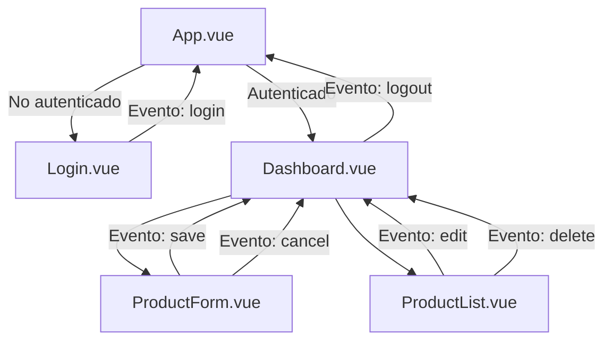

# 🖥️ Gestor de Inventario de Equipos

Aplicación web SPA para la gestión y control de inventario de equipos tecnológicos. Permite registrar, editar, eliminar y filtrar equipos, con un sistema de roles que controla el acceso a las funcionalidades según el tipo de usuario.

---

## 🚀 Stack Tecnológico

| Tecnología | Versión | Rol |
|---|---|---|
| [Vue 3](https://vuejs.org/) | ^3.5 | Framework principal (Composition API) |
| [Vite](https://vitejs.dev/) | ^8.0 | Servidor de desarrollo y bundler |
| [TailwindCSS v4](https://tailwindcss.com/) | ^4.3 | Estilos utilitarios |
| [Remixicon](https://remixicon.com/) | ^4.9 | Iconografía principal |
| [MockAPI](https://mockapi.io/) | - | Backend simulado (REST API) |

---

## 📁 Estructura del Proyecto

```
gestor-inventario/
├── index.html
├── vite.config.js
├── package.json
└── src/
    ├── main.js                        # Punto de entrada de la aplicación
    ├── App.vue                        # Componente raíz
    ├── assets/
    │   ├── ico/
    │   │   └── ico.png                # Ícono de la aplicación
    │   ├── img/
    │   │   └── tecnico.avif           # Imagen decorativa del login
    │   └── style/
    │       └── style.css              # Estilos globales
    ├── components/
    │   ├── Login.vue                  # Pantalla de inicio de sesión
    │   ├── Dashboard.vue              # Panel principal con header y layout
    │   ├── ProductForm.vue            # Formulario para crear/editar equipos
    │   └── ProductList.vue            # Lista/tabla de equipos con filtros
    ├── composables/
    │   ├── useAuth.js                 # Lógica de autenticación y sesión
    │   ├── useProducts.js             # Lógica CRUD de equipos
    │   ├── useProductForm.js          # Estado reactivo del formulario
    │   └── useProductFilter.js        # Filtrado y búsqueda de equipos
    ├── services/
    │   ├── api.js                     # Cliente HTTP genérico (fetch wrapper)
    │   ├── equipoService.js           # Endpoints CRUD de equipos
    │   └── userService.js             # Endpoint de usuarios
    └── helpers/
        └── dateFormatter.js           # Utilidades de formateo de fechas
```

---

## ⚙️ Instalación y Desarrollo

```bash
# 1. Clonar el repositorio
git clone <url-del-repositorio>
cd gestor-inventario

# 2. Instalar dependencias
npm install

# 3. Iniciar servidor de desarrollo
npm run dev

# 4. Construir para producción
npm run build

# 5. Previsualizar la build de producción
npm run preview
```

---

## 🔐 Sistema de Autenticación

La autenticación es de doble nivel: primero intenta validar contra la API, y si falla, usa una lista de usuarios de respaldo (`USUARIOS_FALLBACK`). La sesión se persiste en `sessionStorage`.

### Roles de usuario

| Rol | Permisos |
|---|---|
| `admin` | Ver, crear, editar y **eliminar** equipos |
| `empleado` | Ver y editar equipos. No puede duplicar nombres de equipos existentes |
| `user` | Solo puede **ver** la lista de equipos (modo solo lectura) |

### Credenciales de prueba

| Rol | Email | Contraseña |
|---|---|---|
| Administrador | `admin@test.com` | `admin123` |
| Empleado | `emp@test.com` | `emp123` |
| Usuario | `user@test.com` | `user123` |

---

## 📦 Módulos del Proyecto

### `src/services/api.js`
Cliente HTTP genérico que encapsula `fetch`. Expone el objeto `api` con los métodos:

| Método | Descripción |
|---|---|
| `api.obtener(endpoint)` | Realiza una petición `GET` |
| `api.crear(endpoint, cuerpo)` | Realiza una petición `POST` con cuerpo JSON |
| `api.actualizar(endpoint, cuerpo)` | Realiza una petición `PUT` con cuerpo JSON |
| `api.eliminar(endpoint)` | Realiza una petición `DELETE` |

**Constantes:**
- `URL_BASE`: URL raíz de la API MockAPI.

**Funciones internas:**
- `peticion(endpoint, opciones)`: Función privada que construye y ejecuta la llamada HTTP. Lanza un error si la respuesta no es `ok`.

---

### `src/services/equipoService.js`
Servicio de dominio para los equipos. Utiliza `api` internamente.

| Método | Endpoint | Descripción |
|---|---|---|
| `servicioEquipo.obtenerEquipos()` | `GET /equipo` | Obtiene la lista completa de equipos |
| `servicioEquipo.crearEquipo(datos)` | `POST /equipo` | Crea un nuevo equipo |
| `servicioEquipo.actualizarEquipo(id, datos)` | `PUT /equipo/:id` | Actualiza un equipo existente |
| `servicioEquipo.eliminarEquipo(id)` | `DELETE /equipo/:id` | Elimina un equipo por ID |

---

### `src/services/userService.js`
Servicio de dominio para los usuarios.

| Método | Endpoint | Descripción |
|---|---|---|
| `servicioUsuario.obtenerUsuarios()` | `GET /user` | Obtiene la lista de usuarios desde la API |

---

### `src/helpers/dateFormatter.js`
Utilidades de formateo de fechas.

| Función | Parámetro | Retorna | Descripción |
|---|---|---|---|
| `formatearFechaParaInput(cadenaFecha)` | `string` (ISO) | `string` (`YYYY-MM-DD`) | Convierte una fecha ISO a formato compatible con `<input type="date">` |
| `formatearFechaParaMostrar(cadenaFecha)` | `string` (ISO) | `string` localizado | Convierte una fecha ISO a formato legible en español (ej: `15/06/2025`) |

---

### `src/composables/useAuth.js`
Composable que gestiona toda la lógica de autenticación.

**Constantes:**
- `USUARIOS_FALLBACK`: Array con los 3 usuarios de prueba locales.

**Estado reactivo:**
| Variable | Tipo | Descripción |
|---|---|---|
| `usuarioActual` | `ref(null)` | Objeto del usuario autenticado en sesión |
| `cargandoAuth` | `ref(false)` | Indica si hay una operación de login en curso |

**Funciones exportadas:**
| Función | Descripción |
|---|---|
| `inicializarAuth()` | Lee `sessionStorage` y restaura la sesión si existe. Retorna `true` si había sesión guardada |
| `manejarLogin({ email, password })` | Valida credenciales contra la API y el fallback. Guarda la sesión en `sessionStorage`. Retorna `boolean` |
| `manejarLogout()` | Borra el usuario del estado y del `sessionStorage` |

---

### `src/composables/useProducts.js`
Composable que gestiona el estado y las operaciones CRUD del inventario.

**Estado reactivo:**
| Variable | Tipo | Descripción |
|---|---|---|
| `equipos` | `ref([])` | Array reactivo con la lista de equipos cargados |
| `cargandoEquipos` | `ref(false)` | Indica si hay una operación de API en curso |

**Funciones exportadas:**
| Función | Descripción |
|---|---|
| `obtenerEquipos()` | Carga todos los equipos desde la API y los guarda en `equipos` |
| `agregarEquipo(datosEnvio)` | Crea un equipo nuevo en la API y recarga la lista |
| `actualizarEquipo(datosEnvio)` | Actualiza un equipo existente (espera `{ id, ...datos }`) y recarga |
| `eliminarEquipo(id)` | Elimina un equipo por ID y recarga la lista |

---

### `src/composables/useProductForm.js`
Composable que gestiona el estado reactivo del formulario de creación/edición de equipos.

**Estado reactivo:**
| Variable | Tipo | Descripción |
|---|---|---|
| `estaEditando` | `computed` | `true` si `props.editingProduct` no es nulo |
| `nombre` | `ref('')` | Nombre del equipo |
| `marca` | `ref('')` | Marca del equipo |
| `descripcion` | `ref('')` | Descripción o notas del equipo |
| `encargado` | `ref('')` | Persona responsable del equipo |
| `notificante` | `ref('')` | Persona que notificó el estado del equipo |
| `estado` | `ref(true)` | `true` = Activo, `false` = Inactivo |
| `estadoTexto` | `ref('Activo')` | Representación textual del estado |
| `fechaIngreso` | `ref('')` | Fecha de ingreso del equipo (formato `YYYY-MM-DD`) |
| `fechaEgreso` | `ref('')` | Fecha de egreso del equipo. Al rellenarla, el equipo pasa a Inactivo automáticamente |

**Watchers:**
- Observa `props.editingProduct`: cuando cambia, rellena el formulario con los datos del equipo a editar, o lo reinicia si es `null`.
- Observa `fechaEgreso`: cuando se rellena, pone el estado en Inactivo automáticamente.

**Funciones exportadas:**
| Función | Descripción |
|---|---|
| `manejarCambioEstado()` | Sincroniza `estadoTexto` y `fechaEgreso` al cambiar el toggle de estado |
| `reiniciarFormulario()` | Limpia todos los campos del formulario a sus valores por defecto |
| `manejarEnvio()` | Valida los campos, construye el objeto `datosEnvio` y emite el evento `save` |
| `cancelarEdicion()` | Reinicia el formulario y emite el evento `cancel` |

---

### `src/composables/useProductFilter.js`
Composable que gestiona el filtrado y la búsqueda reactiva de la lista de equipos.

**Estado reactivo:**
| Variable | Tipo | Valor por defecto | Descripción |
|---|---|---|---|
| `busqueda` | `ref('')` | `''` | Texto de búsqueda por nombre o marca |
| `filtroEstado` | `ref('active')` | `'active'` | Filtro de estado: `'all'`, `'active'` o `'inactive'` |
| `equiposFiltrados` | `computed` | - | Lista de equipos filtrada y buscada, derivada de `props.products` |

---

## 🧩 Componentes Vue

### `App.vue`
Componente raíz. Orquesta la autenticación y determina si mostrar `Login` o `Dashboard`.

**Variables locales:**
- `estaCargando`: computed que combina `cargandoAuth || cargandoEquipos` para mostrar el spinner global.

**Funciones:**
- `alIniciarSesion(credenciales)`: Llama a `manejarLogin` y, si tiene éxito, carga los equipos.

---

### `Login.vue`
Pantalla de inicio de sesión.

**Variables locales:**
| Variable | Tipo | Descripción |
|---|---|---|
| `nombreUsuario` | `ref('')` | Campo de email/usuario del formulario |
| `contrasena` | `ref('')` | Campo de contraseña del formulario |
| `mensajeError` | `ref('')` | Mensaje de error de validación local |
| `credencialesDePrueba` | `Array` (constante) | Lista de cuentas de prueba para autorrelleno |

**Funciones:**
| Función | Descripción |
|---|---|
| `rellenarCredenciales(email, pass)` | Rellena automáticamente el formulario con una credencial de prueba |
| `manejarEnvio()` | Valida que los campos no estén vacíos y emite el evento `login` |

---

### `Dashboard.vue`
Panel principal. Contiene el header con información del usuario y organiza `ProductForm` y `ProductList`.

**Variables locales:**
| Variable | Tipo | Descripción |
|---|---|---|
| `equipoEnEdicion` | `ref(null)` | El objeto del equipo que está siendo editado actualmente. `null` si no hay edición activa |

**Funciones:**
| Función | Descripción |
|---|---|
| `manejarGuardado(datosEnvio, estaEditando, id)` | Emite `update-product` o `add-product` según si es edición o creación. Limpia `equipoEnEdicion` |
| `manejarEdicion(equipo)` | Recibe el equipo desde `ProductList` y lo asigna a `equipoEnEdicion` para abrir el formulario en modo edición |
| `manejarEliminacion(id)` | Muestra confirmación y emite `delete-product`. Limpia `equipoEnEdicion` si el equipo eliminado era el que se estaba editando |

---

### `ProductForm.vue`
Formulario para crear y editar equipos. Usa `useProductForm`.

**Props:**
| Prop | Tipo | Requerido | Descripción |
|---|---|---|---|
| `userRole` | `String` | Sí | Rol del usuario actual |
| `editingProduct` | `Object` | No | Objeto del equipo a editar. `null` para modo creación |
| `existingProducts` | `Array` | No | Lista de equipos existentes (para validar duplicados) |

**Eventos emitidos:**
- `save(datosEnvio, estaEditando, id)`: Al guardar el formulario.
- `cancel`: Al cancelar la edición.

---

### `ProductList.vue`
Lista de equipos con dos vistas: tabla en escritorio (≥768px) y tarjetas en móvil (<768px). Usa `useProductFilter`.

**Props:**
| Prop | Tipo | Requerido | Descripción |
|---|---|---|---|
| `userRole` | `String` | Sí | Rol del usuario actual |
| `products` | `Array` | Sí | Lista completa de equipos |
| `editingId` | `String/Number` | No | ID del equipo en edición (para resaltarlo visualmente) |

**Eventos emitidos:**
- `edit(equipo)`: Al hacer clic en "Editar".
- `delete(id)`: Al hacer clic en "Eliminar".

---

## 🌐 API REST

Base URL: `https://6a3180fe7bc5e1c61265d91d.mockapi.io`

| Recurso | Método | Endpoint | Descripción |
|---|---|---|---|
| Equipos | `GET` | `/equipo` | Listar todos los equipos |
| Equipos | `POST` | `/equipo` | Crear un equipo |
| Equipos | `PUT` | `/equipo/:id` | Actualizar un equipo |
| Equipos | `DELETE` | `/equipo/:id` | Eliminar un equipo |
| Usuarios | `GET` | `/user` | Listar todos los usuarios |

### Modelo de datos de un equipo

```json
{
  "id": "1",
  "name": "Servidor Web HP",
  "marca": "Hewlett-Packard",
  "description": "Servidor ubicado en el rack 3",
  "encargado": "Juan Pérez",
  "notificante": "María García",
  "status": true,
  "statusStr": "Activo",
  "fechaIngreso": "2024-01-15T00:00:00.000Z",
  "fechaEgreso": null
}
```

---

## 🔄 Flujo de la Aplicación



---

## 📱 Diseño Responsivo

La aplicación está diseñada con un enfoque **mobile-first**.

| Breakpoint | Ancho | Comportamiento |
|---|---|---|
| **Móvil** | < 640px | Layout vertical; tabla reemplazada por tarjetas; botones a ancho completo |
| **Tablet (sm)** | ≥ 640px | Formulario en 2 columnas; controles de filtro en fila |
| **Escritorio (lg)** | ≥ 1024px | Formulario en 4 columnas; vista de tabla completa; imagen decorativa en login |
| **Máximo** | 1200px | Ancho máximo del contenido del Dashboard |
