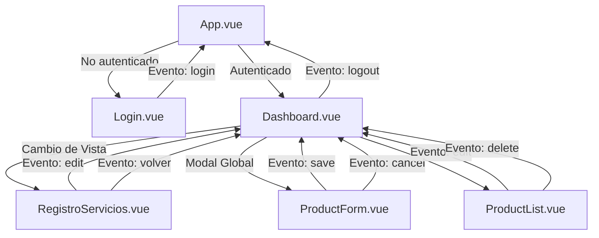

# 🖥️ Gestor de Inventario de Equipos

Aplicación web SPA para la gestión y control de inventario de equipos tecnológicos. Permite registrar, editar, eliminar y filtrar equipos, con un sistema de roles que controla el acceso a las funcionalidades según el tipo de usuario. Incluye además un módulo de Registro de Servicios para equipos por reparar o dañados, y generación de reportes en PDF.

---

## 🚀 Stack Tecnológico

| Tecnología | Versión | Rol |
|---|---|---|
| [Vue 3](https://vuejs.org/) | ^3.5 | Framework principal (Composition API) |
| [Vite](https://vitejs.dev/) | ^8.0 | Servidor de desarrollo y bundler |
| [TailwindCSS v4](https://tailwindcss.com/) | ^4.3 | Estilos utilitarios y diseño responsivo |
| [Remixicon](https://remixicon.com/) | ^4.9 | Iconografía principal |
| [MockAPI](https://mockapi.io/) | - | Backend simulado (REST API) |

---

## 📁 Estructura del Proyecto

```
gestor-inventario/
├── index.html
├── vite.config.js
├── package.json
└── src/
    ├── main.js                        # Punto de entrada de la aplicación
    ├── App.vue                        # Componente raíz
    ├── assets/
    │   ├── ico/
    │   │   └── ico.png                # Ícono de la aplicación
    │   ├── img/
    │   │   └── tecnico.avif           # Imagen decorativa del login
    │   └── style/
    │       └── style.css              # Estilos globales
    ├── components/
    │   ├── Login.vue                  # Pantalla de inicio de sesión
    │   ├── Dashboard.vue              # Panel principal con header, navegación y modal global
    │   ├── ProductForm.vue            # Formulario modal global para crear/editar equipos
    │   ├── ProductList.vue            # Lista de inventario activo (Óptimos y Reparados)
    │   └── RegistroServicios.vue      # Registro de servicios por departamento (Por Reparar / Dañados)
    ├── composables/
    │   ├── useAuth.js                 # Lógica de autenticación y sesión
    │   ├── useProducts.js             # Lógica CRUD de equipos
    │   ├── useProductForm.js          # Estado reactivo y control del formulario
    │   └── useProductFilter.js        # Filtrado de inventario activo (Óptimos / Reparados)
    ├── services/
    │   ├── api.js                     # Cliente HTTP genérico (fetch wrapper)
    │   ├── equipoService.js           # Endpoints CRUD de equipos
    │   └── userService.js             # Endpoint de usuarios
    └── helpers/
        ├── dateFormatter.js           # Utilidades de formateo de fechas
        ├── listDepartamento.js        # Lista estática de departamentos habilitados
        └── reportGenerator.js         # Generador de reportes PDF individuales y filtrados
```

---

## ⚙️ Instalación y Desarrollo

```bash
# 1. Clonar el repositorio
git clone <url-del-repositorio>
cd gestor-inventario

# 2. Instalar dependencias
npm install

# 3. Iniciar servidor de desarrollo
npm run dev

# 4. Construir para producción
npm run build

# 5. Previsualizar la build de producción
npm run preview
```

---

## 🔐 Sistema de Autenticación y Roles

La autenticación se realiza validando contra la API o a través de una lista de usuarios de respaldo local (`USUARIOS_FALLBACK`). La sesión activa se almacena y persiste en el `sessionStorage`.

### Permisos por Rol

| Rol | Permisos |
|---|---|
| `admin` | Acceso total: Ver, crear, editar, eliminar equipos e imprimir reportes. |
| `empleado` | Ver e imprimir reportes. Puede crear/editar equipos, pero no eliminar. No puede duplicar nombres de equipos existentes. |
| `user` | Modo de solo lectura: Ver equipos y exportar reportes en PDF. No puede crear, editar ni eliminar. |

### Credenciales de prueba

| Rol | Email | Contraseña |
|---|---|---|
| Administrador | `admin@test.com` | `admin123` |
| Empleado | `emp@test.com` | `emp123` |
| Usuario | `user@test.com` | `user123` |

---

## 🏷️ Clasificación y Estados de Equipos

El flujo de inventario segmenta los equipos en cuatro estados principales:

1. **Óptimos (Nuevos)**: Equipos marcados con el estado `nuevo: true`. Se muestran en la pantalla inicial de inventario.
2. **Reparados**: Equipos que han salido de revisión correctiva (`status: true` y no marcados como nuevos o dañados). Se muestran en la pantalla inicial de inventario.
3. **Por reparar**: Equipos marcados como no operativos temporalmente (`status: false` y no dañados). Se gestionan en el panel de **Registro de Servicios**.
4. **Dañados**: Equipos con fallas graves irreparables (`danado: true`). Se gestionan en el panel de **Registro de Servicios**.

---

## 📦 Módulos del Proyecto

### `src/helpers/reportGenerator.js`
Módulo encargado de generar reportes en formato PDF listos para imprimir mediante la apertura de un frame imprimible optimizado.
* `imprimirReporte(equipo)`: Genera un reporte detallado e individual de la ficha de un equipo en particular.
* `imprimirReporteFiltrado(filtro, lista)`: Genera un reporte tabular de todos los equipos del inventario que coincidan con el filtro seleccionado.
* `imprimirReporteServicios(filtro, lista)`: Genera un reporte agrupado por departamentos para el panel de Registro de Servicios, mostrando ID, nombre, marca y encargado.

### `src/composables/useProductFilter.js`
Filtra los equipos del inventario inicial excluyendo por completo los equipos con estado **Por reparar** o **Dañados**. Permite alternar la búsqueda entre Todos, Óptimos y Reparados.

### `src/composables/useProductForm.js`
Gestiona el estado del formulario de equipos. Maneja las dependencias lógicas de estado:
* Marcar un equipo como `nuevo` remueve el estado `danado` y coloca `status = true` (Óptimo).
* Marcar un equipo como `danado` remueve el estado `nuevo` y coloca `status = false` (Dañado).
* Al pasar al estado `Reparado` o `Óptimo` (`status = true`), exige rellenar una **Fecha de Revisión**.

---

## 🔄 Flujo de la Aplicación



---

## 📱 Diseño Responsivo

El desarrollo sigue una filosofía **mobile-first**, adaptándose a múltiples resoluciones:
* **Móvil (< 768px)**: Las tablas complejas se reemplazan por tarjetas compactas adaptadas al espacio y las celdas se distribuyen de forma legible.
* **Escritorio (≥ 768px)**: El formulario modal se distribuye en una rejilla de hasta 4 columnas, y los listados se visualizan en tablas completas de alta densidad.
